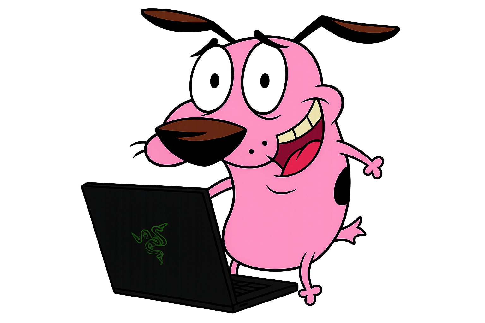

Holaaa, mi nombre es Gian.
Siempre estoy desarrollando proyectos con distintas tecnologías y explorando nuevas herramientas.
He trabajado con lenguajes como Java, PHP, Dart y Python, utilizando frameworks como Laravel, FastAPI, Django y Flutter.
Ahhh… y también amo ir a la playa 🌞

  

## Contacto

